# CP4WAIOPS Accelerator

## Table of Contents
- [CP4WAIOPS Accelerator](#cp4waiops-accelerator)
  - [Table of Contents](#table-of-contents)
  - [Installation dependencies](#installation-dependencies)
  - [Reserve a ROKS cluster](#reserve-a-roks-cluster)
    - [Share access to the ROKS cluster](#share-access-to-the-roks-cluster)
    - [Login to your cluster](#login-to-your-cluster)
      - [If you see Ingress status is Unknown](#if-you-see-ingress-status-is-unknown)
      - [Login to OpenShift web console](#login-to-openshift-web-console)
    - [TechZone support](#techzone-support)
  - [Clone this repository](#clone-this-repository)
    - [Create a GitHub Token](#create-a-github-token)
    - [Clone this repository](#clone-this-repository-1)
  - [CP4WAIOPS 3.1.1 Installation and Demo Environment Steps](#cp4waiops-311-installation-and-demo-environment-steps)
    - [Clone the repository](#clone-the-repository)
    - [Configure a global pull-secret](#configure-a-global-pull-secret)
    - [Install prerequisites](#install-prerequisites)
    - [Run the installation script](#run-the-installation-script)
  - [Delete your cluster](#delete-your-cluster)
  - [Limitations of this Project](#limitations-of-this-project)
  - [Definitions](#definitions)


## Installation dependencies
1. sh
2. OpenShift CLI
3. Red Hat OpenShift Container Platform

## Reserve a ROKS cluster
[Reserve a classic ROKS cluster](https://techzone.ibm.com/collection/custom-roks-vmware-requests)

Underneath `Environments` click on `IBM RedHat Openshift Kubernetes Service (ROKS)`

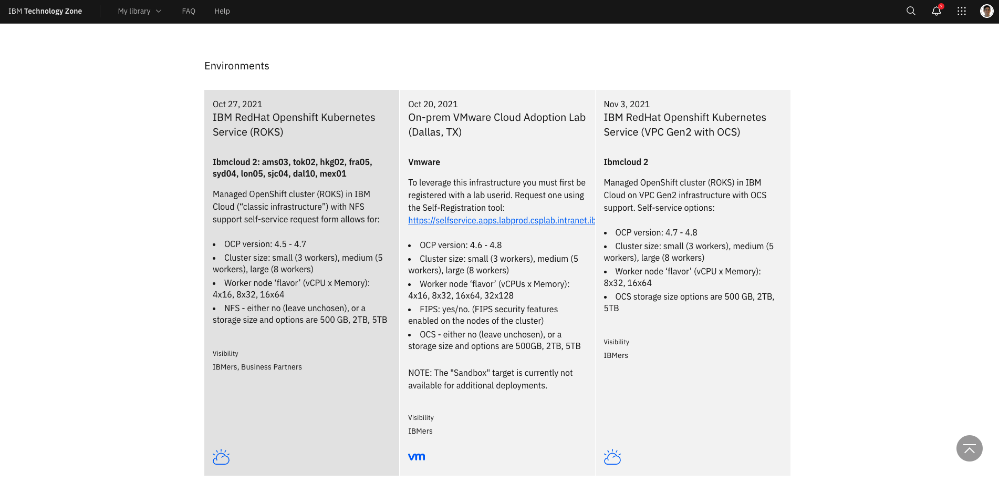

Click `Reserve Now` to create your cluster. The cluster will take some time to provision and it will be available for up to seven days (168 hours).

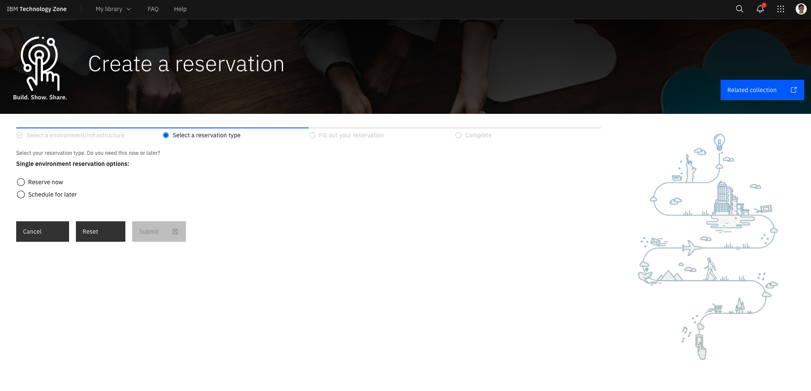

Fill out your reservation with the following details:
1. Name: CP4WAIOPS Accelerator
2. Purpose: Practice / Self-Education
3. Purpose Description: Install and demo CP4WAIOPS on a ROKS cluster.
4. End Date and Time:
   - Select a Date: Select a date that falls seven days from today's date
   - Select a Time: Select a time that falls before your current time
5. Preferred Geography: Choose a location with the lowest Disk Usage, then location closest to you (e.g., Dallas 10 Disk Usage: 25%)
6. Worker Node Count: 5
7. Worker Node Flavor: 16 CPU x 64 GB
8. NFS Size: 2 TB
9. OpenShift Version: 4.7

| Key                  |                                                                                                        Value |
| :------------------- | -----------------------------------------------------------------------------------------------------------: |
| Name:                |                                                                                        CP4WAIOPS Accelerator |
| Purpose:             |                                                                                    Practice / Self-Education |
| Purpose Description: |                                                                Install and demo CP4WAIOPS on a ROKS cluster. |
| End Date and Time:   |     Select a date that falls seven days from today's date. Select a time that falls before your current time |
| Preferred Geography: | Choose a location with the lowest Disk Usage, then location closest to you (e.g., Dallas 10 Disk Usage: 25%) |
| Worker Node Count:   |                                                                                                            5 |
| Worker Node Flavor:  |                                                                                               16 CPU x 64 GB |
| NFS Size:            |                                                                                                         2 TB |
| OpenShift Version:   |                                                                                                          4.7 |

Click `Submit`

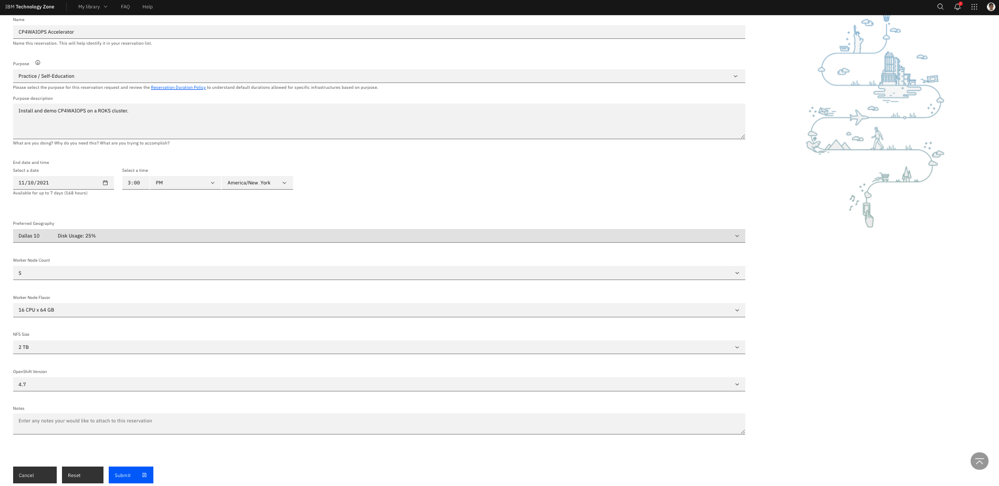

Wait for your cluster to be provisioned. This can take anywhere from 15 minutes to about an hour.

The status of the reservation will turn green for `Scheduled` or `Provisioning`

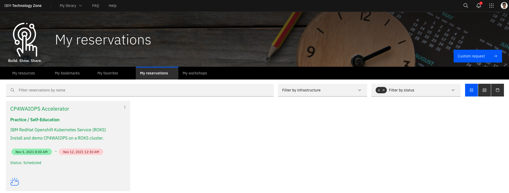

Then the status of the reservation will turn black for `Ready`

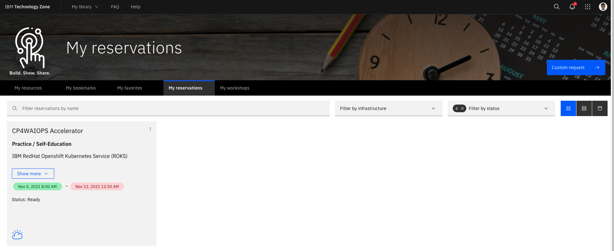

### Share access to the ROKS cluster
[IBM Technology Zone](https://techzone.ibm.com/my/reservations)

Find the reservation that needs to be shared

Click on the three vertical dots menu

Select `Share`

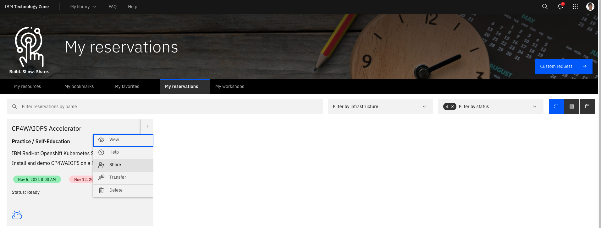

Enter the IBMid to share with

Click on `Share` blue button

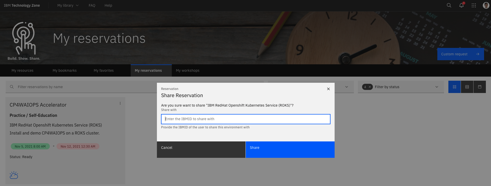

The cluster automatically become available to another user in IBM Cloud.

Once shared it can not be revoked. Only by DTE Admins per owner request.

Shared environment will remain visible in "My reservation" view to its owner only.

### Login to your cluster
You will get an e-mail from IBM Technology Zone verifying that your environment is ready

Click on the `Cluster URL`

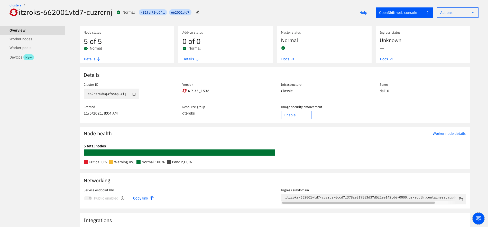

#### If you see Ingress status is Unknown

Log in to IBM Cloud CLI

Click on your user profile

Click on `Log in to CLI and API`

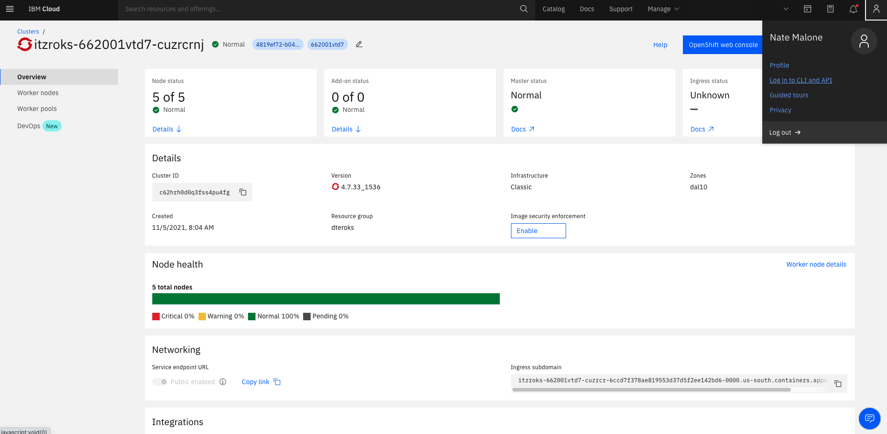

Copy the IBM Cloud CLI (e.g., `ibmcloud login -a https://cloud.ibm.com -u passcode -p <passcode_string>`)

Run it from a terminal

When prompted, select a region closest to your physical location

Get your Cluster Name or ID with the following command, or through the `Cluster URL` found in your e-mail from IBM Technology Zone:
```
ibmcloud ks cluster ls
```

Copy the Name or ID value

Run the following command, replacing `<cluster_name_or_ID>` with the value from the previous step
```
ibmcloud ks ingress status -c <cluster_name_or_ID>
```

Expected output:

```
OK
                     
Ingress Status:   healthy   
Message:          All Ingress components are healthy   

Component             Status    Type   
certificate manager   healthy   secret   
router-default        healthy   router  
```

If Ingress or Component Statuses are not `healthy` then contact ITZ support or look at [IBM's Containers Ingress Status documentation](https://cloud.ibm.com/docs/containers?topic=containers-ingress-status) for clues to solve the issue.

#### Login to OpenShift web console
Click on `OpenShift web console`
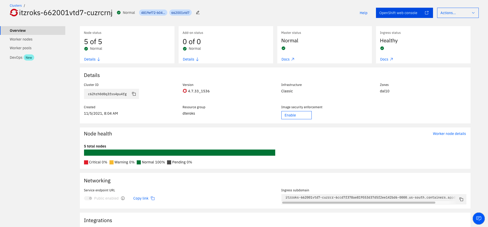

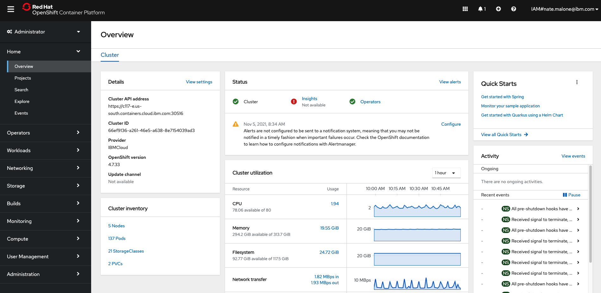

Click on your IBM ID in the top-right hand corner

Then click on `Copy login command`

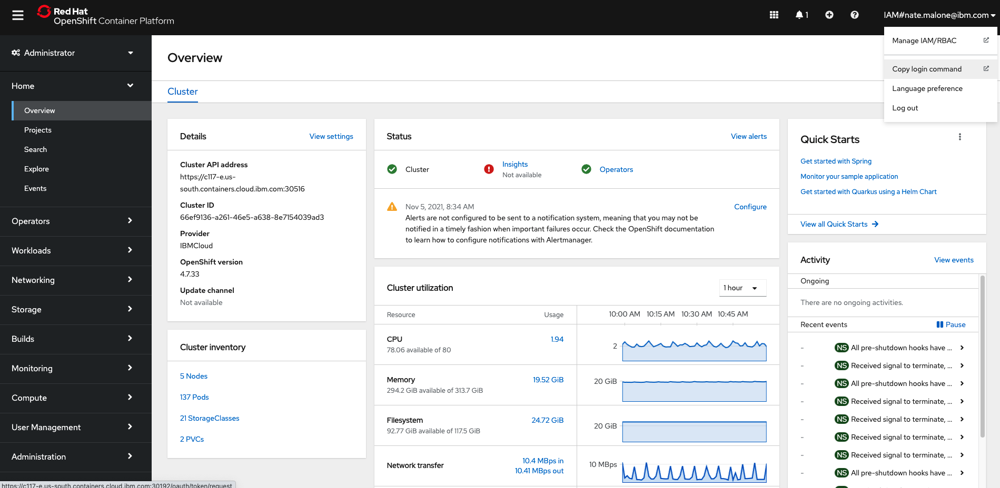

Click on `Display Token`


Copy the command and run it from a terminal. e.g.:
```
oc login --token=<token_code> --server=<server_url:port>

```

### TechZone support
For any questions, contact ITZ support.

Business Partners - Contact ITZ Support - `techzone.help@ibm.com`

IBMers - Make a post on the `#itz-techzone-support` slack channel.

## Clone this repository
### Create a GitHub Token
Verify your email address, if it hasn't been verified yet.

In the upper-right corner of any page, click your profile photo, then click Settings.

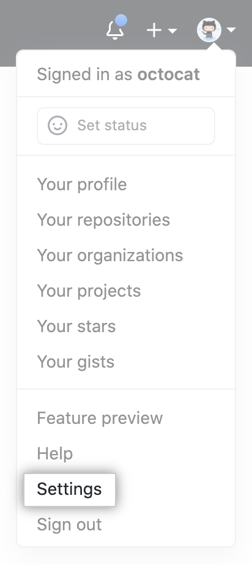

In the left sidebar, click Developer settings.


In the left sidebar, click Personal access tokens.


Click Generate new token.


Give your token a descriptive name.


To give your token an expiration, select the Expiration drop-down menu, then click a default or use the calendar picker.

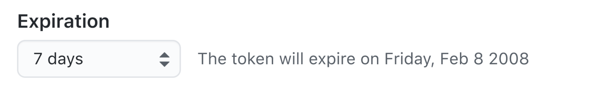

Select the scopes, or permissions, you'd like to grant this token. To use your token to access repositories from the command line, select repo.


Click Generate token.

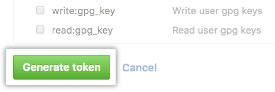

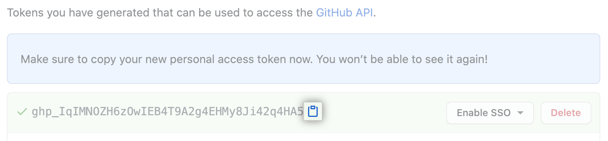

### Clone this repository
Run the following command from the directory you want the repository to exist in:

```
git clone git@github.ibm.com:CP4WAIOPS-Accelerator/CP4WAIOPS.git
```

## CP4WAIOPS 3.1.1 Installation and Demo Environment Steps

### Clone the repository
```
git clone git@github.ibm.com:NIKH/aiops-3.1.git
```

### Configure a global pull-secret
Run the following command:
```
oc get secret -n openshift-config pull-secret -oyaml > pull-secret_backup.yaml
```
In OpenShift web console, go to Secrets in Namespace openshift-config

Open the pull-secretSecret

Select Actions/Edit Secret

Scroll down and click Add Credentials

Enter your Docker credentials

### Install prerequisites
```
brew install wget
./13_install_prerequisites_mac.sh
```

### Run the installation script
[Get your IBM Entitled Registry key](https://myibm.ibm.com/products-services/containerlibrary)

Run the following command, replacing <IBM_Entitlement_Key> with the IBM Entitled Registry key that you obtained in the previous step:
```
./10_install_aiops.sh -t <IBM_Entitlement_Key>
```

This will install the following operators:

- Knative
- Strimzi
- CP4WAIOPS
- OpenLDAP
- Demo Apps
- Register LDAP Users
- Gateway
- Housekeeping
- Additional Routes (Topology, Flink, Strimzi)
- Create OCP User (serviceaccount demo-admin)
- Patch Ingress
- Adapt NGINX Certificates
- Adapt Slack Welcome message to /welcome


## Delete your cluster
[Delete your classic ROKS cluster](https://techzone.ibm.com/my/reservations)

Click the three dots icon in the top-right corner of your reservation

Click `Delete`

Your cluster will automatically be deleted from IBM Cloud

## Limitations of this Project

## Definitions
IBM RedHat Openshift Kubernetes Service (ROKS)