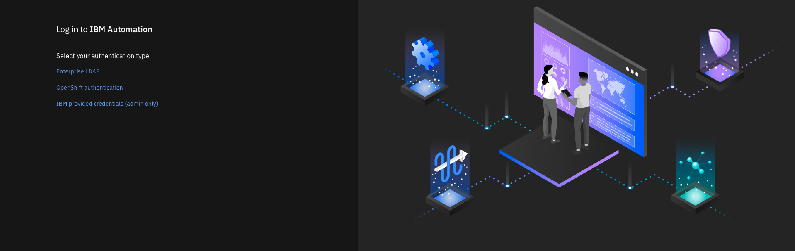

# Cloud Pak for Watson AIOps (CP4WAIOPS) Accelerator

## Mission Statement
Leveraging the benefits of CP4WAIOPS and minimizing the implementation period has enabled us to do a deep dive into several use cases. This project is a starting point for anyone coming from any level of CP4WAIOPS. Get started by requesting the TechZone Collection environment or by running a single command using your local workstation. This project will install CP4WAIOPS, preloaded with applications for simulating real time incidences. This project can assist the visibility into your organization's infrastructure so that you can confidently assess, diagnose, and resolve incidents across mission-critical workloads. With these issues being at the forefront of engagements for Client Engineering, we believe this is a reusable asset for our department.

- [Cloud Pak for Watson AIOps (CP4WAIOPS) Accelerator](#cloud-pak-for-watson-aiops-cp4waiops-accelerator)
  - [Mission Statement](#mission-statement)
  - [Business Goals](#business-goals)
  - [Architecture](#architecture)
  - [Install](#install)
  - [Demo](#demo)
  - [Challenges](#challenges)
  - [Q & A](#q--a)
  - [Work in Progress:](#work-in-progress)
    - [Log into IBM Automation](#log-into-ibm-automation)
  - [Slack integration](#slack-integration)
    - [Initial Slack Setup](#initial-slack-setup)
## Business Goals
Research new solutions to assess, diagnose and resolve incidents
Collaborate with experts to identify, evaluate and recommend technical solutions to support project requirements
Integrate industry trends, emerging technologies and standards
Drive IT projects
Solve complex problems
Test innovative approaches

## Architecture
Terraform - infrastructure as code
Ansible - configuration management
IBM Cloud - cloud computing services
NGINX - web server
Datadog - cloud monitoring service
Kafka - data streaming platform

## Install
TOO:
```
curl https://website/path-to-file.sh
``` 
Request a TechZone Collection enviornment

## Demo
TODO:
run script
seismic documentation on how to run/do the demo

## Challenges


## Q & A


## Work in Progress:

### Log into IBM Automation
1. Log into IBM Automation:
    1. Go to the provided URL that you can find in the `./provided-credentials` file from a web browser
    2. If you see a "Your connection is not private" message for the `cpd-<NAMESPACE>` url, click **Advanced**
    
    2. Then click **Proceed to URL (unsafe)** at the bottom.
    
    3. Repeat steps #1 and #2 for the "Your connection is not private" message for the the `cp-console` url
    4. On the **Login to IBM Automation** screen, click **IBM provided credentials (admin only)** and input your credentials that you can find in the `./provided-credentials` file
    
    
    5. It is strongly recommended that you change the initial password the first time that you log in to the web client.

## Slack integration
### Initial Slack Setup 

For the system to work you need to setup your own secure gateway and slack workspace. It is suggested that you do this within the public slack so that you can invite the customer to the experience as well. It also makes it easier for is to release this image to Business partners

You will need to create your own workspace to connect to your instance of CP4WAOps.

Here are the steps to follow:

1. [Create Slack Workspace](./tools/3_slack/1_slack_workspace.md)
1. [Create Slack App](./tools/3_slack/2_slack_app_create.md)
1. [Create Slack Channels](./tools/3_slack/3_slack_channel.md)
1. [Create Slack Integration](./tools/3_slack/4_slack_integrate.md)
1. [Get the Integration URL - Public Cloud - ROKS](./tools/3_slack/5_slack_url_public.md) OR 
1. [Get the Integration URL - Private Cloud - Fyre/TEC](./tools/3_slack/5_slack_url_private.md)
1. [Create Slack App Communications](./tools/3_slack/6_slack_app_integration.md)
1. [Prepare Slack Reset](./tools/3_slack/7_slack_reset.md)